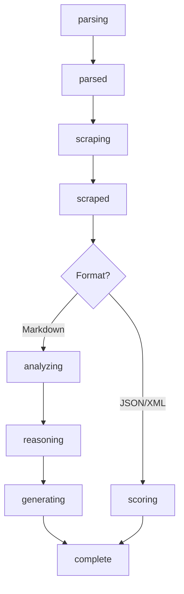

# Progress Phases

The `atsStream` function provides real-time progress updates through the `onProgress` callback. This document details all available phases, their data structures, and usage patterns.

## Phase Overview

The ATS analysis process follows this sequence:

```
parsing → parsed → scraping → scraped → [analyzing → reasoning → generating] OR [scoring] → complete
```

### Phase Flow Diagram



### Phase Details by Format

**Markdown Format Flow:**
```
parsing → parsed → scraping → scraped → analyzing → reasoning → generating → complete
```

**JSON/XML Format Flow:**
```
parsing → parsed → scraping → scraped → scoring → complete
```

## Phase Details

### 1. `parsing`
**When:** Resume PDF parsing begins  
**Data:** `undefined`  
**Purpose:** Indicates the system is extracting text from the PDF resume

```typescript
onProgress({ phase: 'parsing' })
```

### 2. `parsed`
**When:** Resume parsing completes successfully  
**Data:** `{ name?: string, email?: string }`  
**Purpose:** Confirms successful parsing with extracted contact information

```typescript
onProgress({ 
  phase: 'parsed', 
  data: { 
    name: 'John Doe', 
    email: 'john@example.com' 
  } 
})
```

### 3. `scraping`
**When:** Job posting scraping begins  
**Data:** `undefined`  
**Purpose:** Indicates the system is fetching and parsing the job posting

```typescript
onProgress({ phase: 'scraping' })
```

### 4. `scraped`
**When:** Job posting scraping completes successfully  
**Data:** `{ title: string, company: string }`  
**Purpose:** Confirms successful job data extraction

```typescript
onProgress({ 
  phase: 'scraped', 
  data: { 
    title: 'Senior Frontend Engineer', 
    company: 'Acme Corp' 
  } 
})
```

### 5. `analyzing` (Markdown format only)
**When:** AI analysis begins for markdown output  
**Data:** `undefined`  
**Purpose:** Indicates the AI is starting its compatibility analysis

```typescript
onProgress({ phase: 'analyzing' })
```

### 6. `reasoning` (Markdown format only)
**When:** AI is generating reasoning text  
**Data:** `{ text: string }`  
**Purpose:** Streams the AI's reasoning process in real-time

```typescript
onProgress({ 
  phase: 'reasoning', 
  data: { 
    text: 'I need to analyze the keyword matches between...' 
  } 
})
```

### 7. `generating` (Markdown format only)
**When:** AI is generating the final markdown report  
**Data:** `{ text: string }`  
**Purpose:** Streams the final report content as it's generated

```typescript
onProgress({ 
  phase: 'generating', 
  data: { 
    text: '# ATS Compatibility Report\n\n## Summary...' 
  } 
})
```

### 8. `scoring` (JSON/XML format only)
**When:** AI is generating structured score data  
**Data:** `Partial<Score>` (streaming partial score object)  
**Purpose:** Streams partial score data as it's generated

```typescript
onProgress({ 
  phase: 'scoring', 
  data: { 
    score: 75,
    keywordAnalysis: { /* partial data */ }
  } 
})
```

### 9. `complete`
**When:** Analysis completes successfully  
**Data:** `Score | undefined` (final result for JSON/XML, undefined for markdown)  
**Purpose:** Indicates successful completion

```typescript
// For JSON/XML
onProgress({ 
  phase: 'complete', 
  data: { 
    score: 85,
    keywordAnalysis: { /* complete data */ },
    suggestions: [ /* complete suggestions */ ],
    analysis: { /* complete analysis */ },
    optimizations: [ /* complete optimizations */ ]
  } 
})

// For Markdown
onProgress({ phase: 'complete' })
```

## Format-Specific Behavior

### Markdown Format
- Uses `analyzing` → `reasoning` → `generating` → `complete` flow
- `reasoning` and `generating` phases stream text content
- No structured data in `complete` phase

### JSON/XML Format
- Uses `scoring` → `complete` flow
- `scoring` phase streams partial score objects
- `complete` phase includes final structured result

## TypeScript Interface

The library provides comprehensive TypeScript types for better developer experience:

```typescript
import { 
  ProgressUpdate, 
  ProgressPhase, 
  ProgressData,
  ParsedData,
  ScrapedData,
  TextData,
  ScoringData
} from 'jobheist'

// Main progress update interface
interface ProgressUpdate {
  phase: ProgressPhase
  data?: ProgressData
}

// Available phases
type ProgressPhase = 
  | 'parsing' 
  | 'parsed' 
  | 'scraping' 
  | 'scraped' 
  | 'analyzing' 
  | 'reasoning' 
  | 'generating' 
  | 'scoring' 
  | 'complete'

// Phase-specific data types
interface ParsedData {
  name?: string
  email?: string
}

interface ScrapedData {
  title: string
  company: string
}

interface TextData {
  text: string
}

interface ScoringData {
  score?: number
  keywordAnalysis?: Partial<Score['keywordAnalysis']>
  suggestions?: Partial<Score['suggestions']>
  analysis?: Partial<Score['analysis']>
  optimizations?: string[]
}

// Union type for all possible data
type ProgressData = 
  | ParsedData 
  | ScrapedData 
  | TextData 
  | ScoringData 
  | Score 
  | undefined
```

### Type-Safe Progress Handling

```typescript
import { atsStream, ProgressUpdate } from 'jobheist'

await atsStream('resume.pdf', 'https://job-url', {
  onProgress: (progress: ProgressUpdate) => {
    // TypeScript will provide autocomplete and type checking
    switch (progress.phase) {
      case 'parsed':
        // progress.data is typed as ParsedData
        console.log(`Parsed resume for: ${progress.data?.name}`)
        break
      case 'scraped':
        // progress.data is typed as ScrapedData
        console.log(`Job: ${progress.data?.title} at ${progress.data?.company}`)
        break
      case 'reasoning':
      case 'generating':
        // progress.data is typed as TextData
        process.stderr.write(progress.data?.text || '')
        break
      case 'scoring':
        // progress.data is typed as ScoringData
        if (progress.data?.score) {
          console.log(`Current score: ${progress.data.score}/100`)
        }
        break
      case 'complete':
        // progress.data is typed as Score | undefined
        if (progress.data) {
          console.log(`Final score: ${progress.data.score}/100`)
        }
        break
    }
  }
})
```

## Usage Examples

### Basic Progress Tracking
```typescript
await atsStream('resume.pdf', 'https://job-url', {
  onProgress: (progress) => {
    console.log(`Phase: ${progress.phase}`)
    if (progress.data) {
      console.log('Data:', progress.data)
    }
  }
})
```

### CLI-Style Progress Messages
```typescript
const phases: Record<string, string> = {
  parsing: '⏳ Parsing resume...',
  scraping: '⏳ Fetching job posting...',
  analyzing: '⏳ Analyzing compatibility...',
  generating: '📝 Generating report...',
  complete: '✅ Analysis complete!'
}

await atsStream('resume.pdf', 'https://job-url', {
  onProgress: (progress) => {
    if (phases[progress.phase]) {
      console.error(phases[progress.phase])
    }
  }
})
```

### Real-time Text Streaming
```typescript
await atsStream('resume.pdf', 'https://job-url', {
  format: 'markdown',
  onProgress: (progress) => {
    if (progress.phase === 'reasoning' && progress.data?.text) {
      process.stderr.write(progress.data.text)
    }
    if (progress.phase === 'generating' && progress.data?.text) {
      process.stdout.write(progress.data.text)
    }
  }
})
```

### Score Tracking for JSON/XML
```typescript
await atsStream('resume.pdf', 'https://job-url', {
  format: 'json',
  onProgress: (progress) => {
    if (progress.phase === 'scoring' && progress.data?.score) {
      console.log(`Current score: ${progress.data.score}/100`)
    }
  }
})
```

## Error Handling

The `onProgress` callback is optional and errors in the callback won't stop the analysis process. However, it's recommended to handle errors gracefully:

```typescript
await atsStream('resume.pdf', 'https://job-url', {
  onProgress: (progress) => {
    try {
      // Your progress handling logic
      handleProgress(progress)
    } catch (error) {
      console.error('Progress callback error:', error)
    }
  }
})
```

## Performance Notes

- Progress updates are sent asynchronously and may arrive out of order
- The `reasoning` and `generating` phases can generate many rapid updates
- Consider debouncing or throttling UI updates for these phases
- The `complete` phase is always the final update
